# Capitulo4-BasesDeDatos

Se va a trabajar con el monte público Pinar de Yunquera, con código MA-30037-AY. Se trata de un monte de unas 2.000 ha de titularidad pública, perteneciente al Ayuntamiento de Yunquera y cuya gestión ha venido realizando la Consejería de Medio Ambiente de la Junta de Andalucía. Está localizado en el interior del Parque Nacional Sierra de las Nieves y contiene una variedad florística de incalculable valor.

## 1. ACCESO A BASES DE DATOS CARTOGRÁFICAS

### 1.1. Mapas

Primero, se va a proceder a descargar la capa de Montes Públicos de Málaga que contiene los límites del monte con el que se va a trabajar Pinar de Yunquera, con código MA-30037-AY. Para ello, es necesario establecer el directorio de trabajo donde se van a realizar las descargas. Para saber cuál es y cambiarlo si lo consideramos oportuno, es necesario ejecutar el código:

```r
#Consultar el directorio de trabajo
getwd()
```

Se establece un nuevo directorio de trabajo que va a involucrar únicamente a los archivos del presente capítulo:

```r
#Establecer el directorio de trabajo
setwd("C:/DESCARGA/") #Adaptar a la ruta que se vaya a emplear en el equipo
```

Seguidamente, se descargan los límites del monte.

```r
#Descarga de informacion geografica desde url
url<-"http://www.juntadeandalucia.es/medioambiente/portal_web/web/temas_ambientales/montes/gestion_forestal_sostenible/static_files/catmalaga.kml"
download.file(url,destfile="Montes_Publicos_Malaga.kml")
```

En el directorio de trabajo establecido deberá observarse un nuevo archivo con el nombre Montes_Publicos_Malaga.kml

Para visualizar el archivo, primero se necesita el paquete sf, que permite representar entidades simples como registros en un data.frame de R con una columna de lista de geometrías.

```r
#Instalación y activación del paquete para la lectura de la capa kml
# install.packages("sf")
library(sf)
```

Para conocer qué contiene la capa kml que se ha descargado anteriormente, se emplea la siguiente función:

```r
#Descripción de la capa kml
st_layers("Montes_Publicos_Malaga.kml")
```

```r annotate
## Driver: KML 
## Available layers:
##     layer_name geometry_type features fields
## 1 Código Monte    3D Polygon      564      2
```

El resultado está indicando que la capa la componen 564 entidades, es decir, 564 polígonos de montes públicos.

Seguidamente se va a leer la capa

```r
#Lectura de la capa kml
Montes.Publicos<-st_read("Montes_Publicos_Malaga.kml")
Montes.Publicos
```

```r annotate
## Simple feature collection with 564 features and 2 fields
## Geometry type: POLYGON
## Dimension:     XYZ
## Bounding box:  xmin: -5.612852 ymin: 36.43445 xmax: -3.768216 ymax: 37.27591
## z_range:       zmin: 0 zmax: 0
## Geodetic CRS:  WGS 84
## First 10 features:
##           Name Description                       geometry
## 1  MA-10004-JA             POLYGON Z ((-4.754273 36.60...
## 2  MA-10006-JA             POLYGON Z ((-4.986634 36.55...
## 3  MA-10007-JA             POLYGON Z ((-4.846114 36.56...
## 4  MA-10007-JA             POLYGON Z ((-4.852688 36.56...
## 5  MA-10007-JA             POLYGON Z ((-4.850509 36.57...
## 6  MA-10007-JA             POLYGON Z ((-4.851883 36.58...
## 7  MA-10007-JA             POLYGON Z ((-4.852651 36.58...
## 8  MA-10007-JA             POLYGON Z ((-4.884442 36.60...
## 9  MA-10008-JA             POLYGON Z ((-4.913738 36.54...
## 10 MA-10009-JA             POLYGON Z ((-4.712249 36.79...
```

La capa recoge los códigos de los montes a través del campo *Name*. El monte sobre el que se está trabajando se conoce como **Pinar de Yunquera y Sierra Blanquilla** y recibe la codificación *MA-30037-AY*, con lo que podemos seleccionar la zona de estudio así:

```r
MA.30037.AY<-Montes.Publicos[which(Montes.Publicos$Name=="MA-30037-AY"),1]
```

Y visualizarlo en un mapa de la siguiente forma:

```r
plot(Montes.Publicos[which(Montes.Publicos$Name=="MA-30037-AY"),1],
     main="Monte Pinar de Yunquera y Sierra Blanquilla",
     axes=TRUE)
```

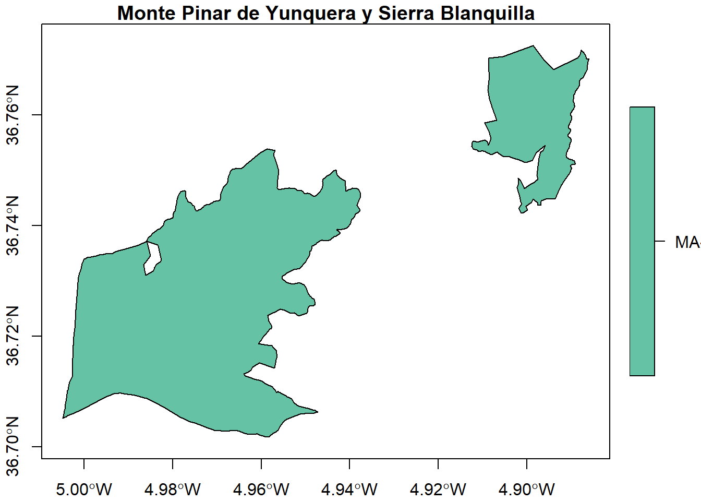

Como se puede apreciar en el mapa, la ordenación se compuso por dos montes: **Pinar de Yunquera** y **Sierra Blanquilla**. La práctica, sin embargo, se va a centrar en la zona donde se encuentran las poblaciones de *Abies pinsapo*, que se localizan en **Pinar de Yunquera** por lo que se selecciona únicamente dicho territorio:

```r
Pinar.Yunquera<-MA.30037.AY[1,]
plot(Pinar.Yunquera[,1], main="Monte Pinar de Yunquera", axes=TRUE)
```

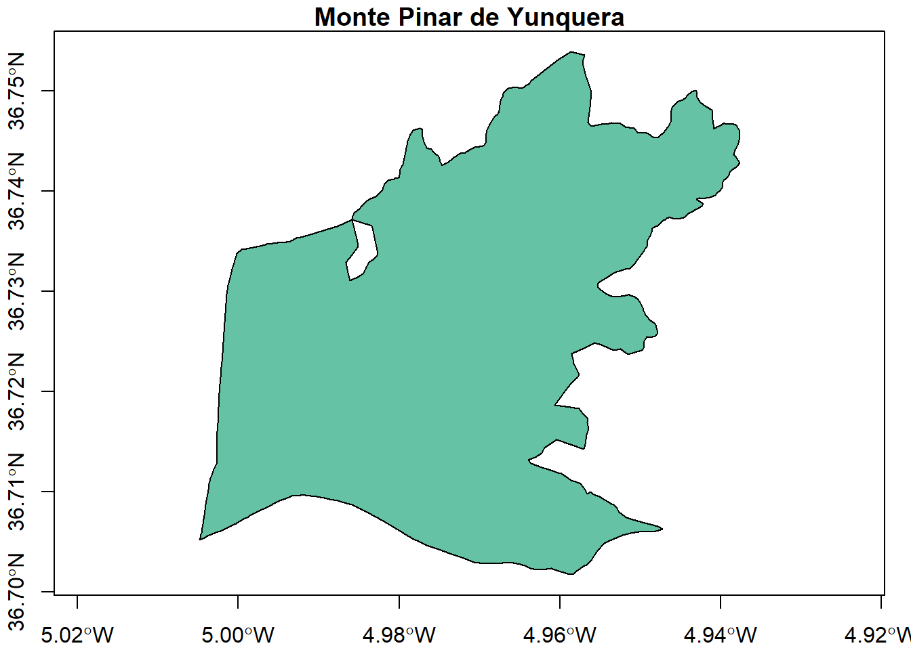

### 1.2. Ortofotos e imágenes

Para comprender mejor la zona de estudio, es necesario tener una imagen de referencia.

Una de las opciones es el empleo de un servicio wms (web map service) de ortofotografías que evita tener que descargar las imágenes, con el consecuente ahorro de tiempo y espacio.

El servicio de ortofotos de máxima actualidad del Plan Nacional de Ortofotografía Aérea (PNOA) permite la visualización de imágenes en mosaicos de distinta fecha de adquisición y distinta resolución (50 y 25 cm). El servicio muestra esos mosaicos según el estilo por defecto definido en Inspire. Los datos se actualizan periódicamente y sus actualizaciones se anuncian en el canal RSS del IGN (<http://www.ign.es/ign/rss>). El acceso o conexión a este servicio para obtener las funcionalidades para las que está pensado es gratuito en cualquier caso, siempre que se mencione la autoría del IGN como propietario del servicio y de su contenido.

Para visualizar el resultado con los datos de trabajo se ejecuta el siguiente código. En él se emplea la función *st_zm()* para borrar los valores de coordenada z que la componente *geometry* de la forma espacial guarda del monte. Además se centra la vista del mapa sobre las coordenadas centrales del monte con la función *setView()*. Y finalmente, se hace la llamada a las imágenes de las ortofotografías históricas del año 2008, año en el que se realizó la ordenación del monte.

```r
#Dirección wms
wms_orto<-"http://www.ign.es/wms/pnoa-historico?"

#Instalación y activación del paquete para realizar mapas interactivos 
# install.packages("leaflet")
library(leaflet)

m.orto = leaflet(st_zm(Pinar.Yunquera)) %>% 
  setView(-4.95,36.73,12) %>%
  addWMSTiles(wms_orto,
              layers="PNOA2008",
              options=WMSTileOptions(format="image/png",transparent = TRUE)) %>%
    addPolygons()
m.orto 
```

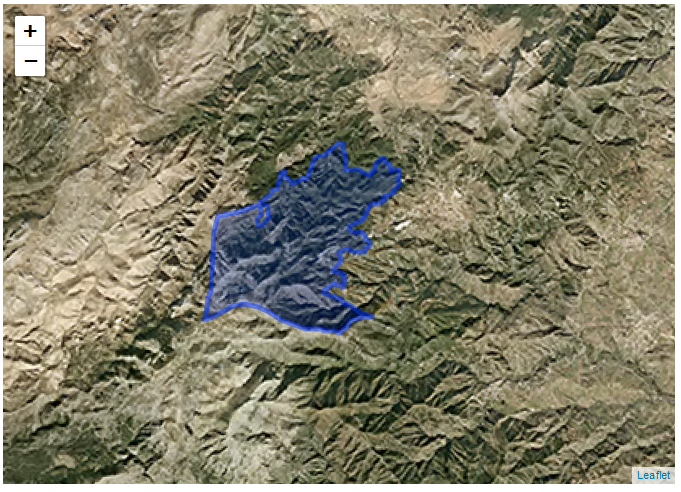

Cuando en la zona de trabajo no se disponen de imágenes u ortofografías servidas a través de wms, se puede visualizar el monte empleando alguna capa de la lista de proveedores. En este caso, como ejemplo, se ha seleccionado la imaginería mundial proporcinada por la empresa ESRI y que contiene imágenes satelitales y aéreas en todo el mundo. Los mapas incluyen imágenes TerraColor de 15 m para las escalas medias e imágenes de los satélites SPOT de 2.5 m para escalas mayores. En muchas partes del mundo se muestran imágenes submétricas de Maxar. También, en otras partes del mundo, la comunidad de usuarios de SIG ha contribuido con imágenes en diferentes resoluciones.

```r
m.esri = leaflet(st_zm(Pinar.Yunquera)) %>% 
  setView(-4.95,36.73,12) %>%
  addTiles()%>% 
  addProviderTiles("Esri.WorldImagery") %>%
  addPolygons()
m.esri
```

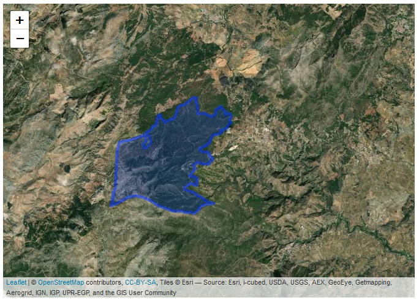

### 1.3. Otras fuentes cartográficas

A veces se hace necesario utilizar otras fuentes cartográficas, como es el caso de los Modelos Digitales del Terreno o el Mapa Topográfico Nacional. Ambos productos están disponibles a través del [Centro de Descargas del Centro Nacional de Información Geográfica](https://centrodedescargas.cnig.es/CentroDescargas/index.jsp#). En [este video de youtube](https://www.youtube.com/watch?v=2u88We_Zyzg) se explica la descarga de las fuentes cartográficas en cuatro sencillos pasos. 

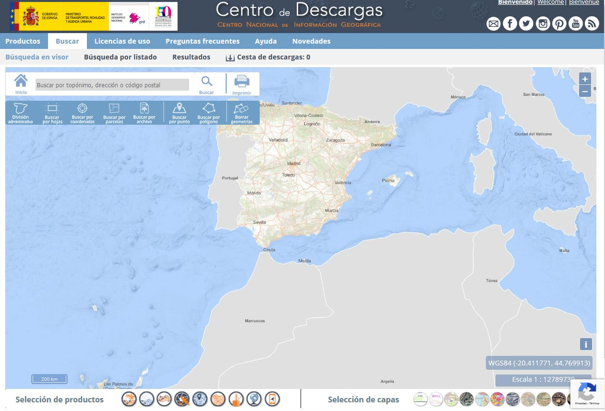

Una vez obtenidos los productos, se cargan como variables dentro del entorno de R utilizando la librería *raster*.

```r
library(raster)
MDT<-raster("PNOA_MDT05_ETRS89_HU30_1051_LID.asc")
```

Con la función *summary* se consigue un resumen de las estadísticas de la capa: valores mínimos, máximos, mediada, cuartiles y, si existen valores sin datos, número de NA's

```r
summary(MDT)
```

```r annotate
##         PNOA_MDT05_ETRS89_HU30_1051_LID
## Min.                           147.9620
## 1st Qu.                        683.4445
## Median                         832.7165
## 3rd Qu.                       1060.7570
## Max.                          1907.6650
## NA's                             0.0000
```

Y además se puede echar un vistazo a los atributos de la capa.

```r
MDT
```

```r annotate
## class      : RasterLayer 
## dimensions : 3847, 6053, 23285891  (nrow, ncol, ncell)
## resolution : 5, 5  (x, y)
## extent     : 304447.5, 334712.5, 4059438, 4078673  (xmin, xmax, ymin, ymax)
## crs        : NA 
## source     : PNOA_MDT05_ETRS89_HU30_1051_LID.asc 
## names      : PNOA_MDT05_ETRS89_HU30_1051_LID
```

Como se puede apreciar con el atributo *crs* (Coordinate Reference System) la capa carece de sistema de coordenadas de referencia. El sistema manejado por el IGN permite conocer el sistema de coordenadas que emplea el archivo descargado a través del nombre del mismo. Así se puede conocer que el modelo que se está empleando pertene al sistema de coordenadas locales ETRS89 UTM en la zona 30 Norte. Ésto se introduce en los argumentos de la siguiente manera:

```r
crs(MDT)<-"+proj=utm +zone=30 +ellps=GRS80 +units=m +no_defs"
MDT
```

```r annotate
## class      : RasterLayer 
## dimensions : 3847, 6053, 23285891  (nrow, ncol, ncell)
## resolution : 5, 5  (x, y)
## extent     : 304447.5, 334712.5, 4059438, 4078673  (xmin, xmax, ymin, ymax)
## crs        : +proj=utm +zone=30 +ellps=GRS80 +units=m +no_defs 
## source     : PNOA_MDT05_ETRS89_HU30_1051_LID.asc 
## names      : PNOA_MDT05_ETRS89_HU30_1051_LID
```

Como se puede apreciar, el sistema de referencia del modelo del terreno descargado no coincide con el sistema de referencia del monte según se ha extraído de la capa kml. De ahí que sea necesario reproyectar la capa de límites del monte al sistema de coordenadas del MDT. 

```r
Pinar.Yunquera.t<-st_transform(Pinar.Yunquera,crs=st_crs(MDT))

plot(MDT, main="Modelo Digital del Terreno")
plot(st_geometry(Pinar.Yunquera.t[,1]),add=TRUE)
```

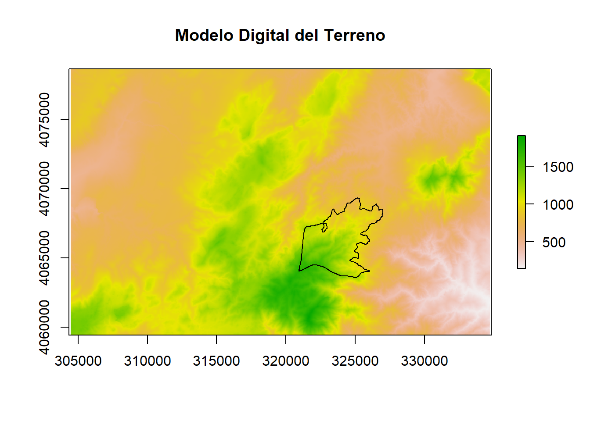

Emplear el modelo completo implica utilizar unas 60.000 hectáreas, lo que ralentiza los procesos en los que se vea involucrada dicha capa. Para agilizarlos, es recomendable recortar el modelo del terreno por la extensión que ocupa los límites del monte con el que se está trabajando.

```r
MDT.recorte<-crop(MDT,extent(Pinar.Yunquera.t[,1]))
plot(MDT.recorte)
plot(st_geometry(Pinar.Yunquera.t[,1]),add=TRUE)
```

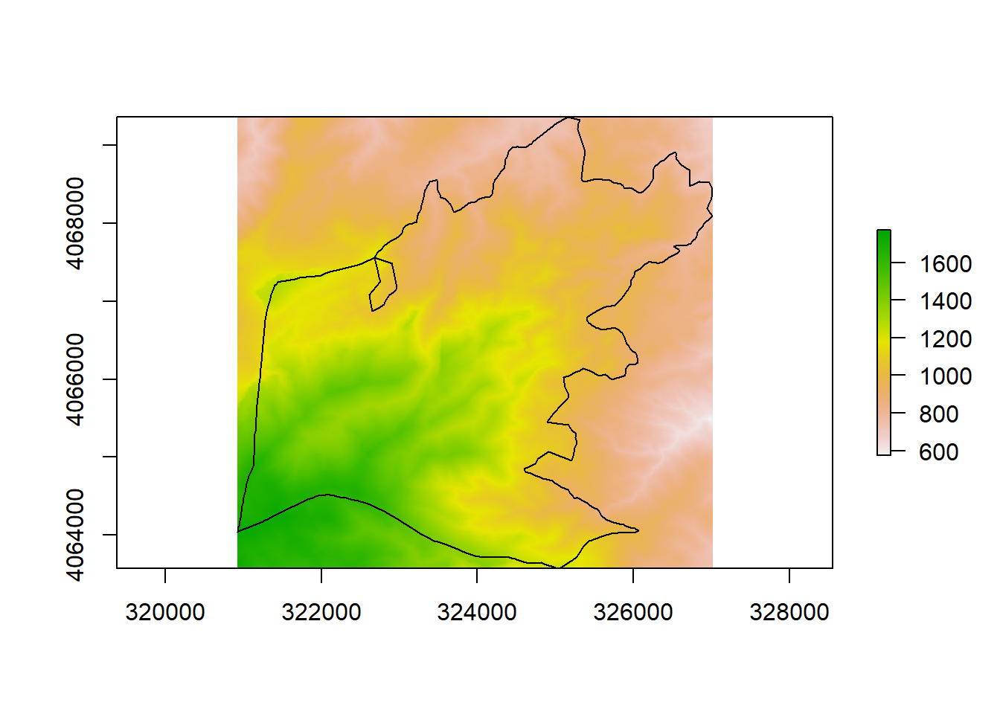

Y finalmente, podemos visualizarlo sobre un mapa dinámico para orientarse sobre el terreno.

```r
m.MDT = leaflet(st_zm(Pinar.Yunquera)) %>% 
  setView(-4.95,36.73,12) %>%
  addTiles()%>% 
  addPolygons()%>%
  addRasterImage(MDT.recorte, project = TRUE)
m.MDT
```

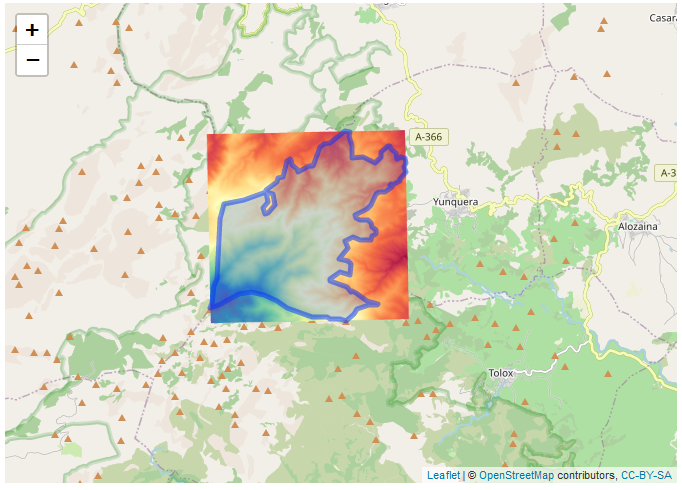

## 2. ARMONIZACIÓN ENTRE BASES DE DATOS

La información que proporcionan las parcelas medidas en una única ocasión no se incluye, lógicamente, el crecimiento de las variables dendrométricas y dasométricas, por lo que con esos datos no es posible utilizar determinadas técnicas de ajuste estadístico que resultan muy efectivas y prácticas si se dispone de datos de crecimiento. Por tanto, a partir de los datos de un único inventario sólo es posible la elaboración de modelos estáticos, como son las tablas de producción de selvicultura media observada, que reflejan únicamente un número limitado de evoluciones de la densidad, o los diagramas de manejo de la densidad. La realización de un segundo inventario permite disponer de datos reales de crecimiento, lo que posibilita el desarrollo de modelos dinámicos, más realistas que los estáticos.

El Inventario Forestal Nacional (IFN) podría definirse como un proyecto encaminado a obtener el máximo de información posible sobre la situación, régimen de propiedad y protección, naturaleza, estado legal, probable evolución y capacidad productora de todo tipo de bienes de los montes españoles. Este inventario caracteriza los tipos de montes en España, cuantificando los recursos forestales disponibles, y presentando datos de densidades, existencias, crecimientos, etc., y facilitando otros parámetros que describen los bosques y las superficies desarboladas en España así como su biodiversidad, todo ello con una metodología y características comunes para todo el territorio. El inventario proporciona una información estadística homogénea y adecuada sobre el estado y la evolución de los ecosistemas forestales españoles que sirve, entre otros, como instrumento para la coordinación de las políticas forestales y de conservación de la naturaleza. La unidad básica de trabajo es la provincia y, al ser un inventario continuo, se repiten las mismas mediciones cada 10 años, recorriéndose todo el territorio nacional en cada ciclo decenal [^1]

[^1]:https://www.mapa.gob.es/es/desarrollo-rural/estadisticas/Inventarios_nacionales.aspx

### 2.1. Recopilación de los datos

#### 2.1.1. IFN2

El segundo ciclo del Inventario Forestal Nacional (IFN2) se inició en 1986 y acabó en 1996. Los datos presentados contienen toda la información disponible del IFN2 digitalizada para la correspondiente provincia y se presenta en dos formas, cartográfica y alfanumérica. 

La primera en un formato tipo sistema de información geográfica (SIG) y corresponde a los estratos, los tipos de propiedad y a las parcelas de campo.

La información alfanumérica está separada en dos grupos: tablas de la publicación y ficheros del proceso de datos. El primero contiene los mismos cuadros de letras y cifras que el libro en soporte papel publicado. En cambio, Los ficheros del proceso de datos se componen de la información presente en los estadillos de las parcelas de campo, de los resultados intermedios del proceso no publicados y de los estadísticos de los parámetros de los árboles medidos, especialmente interesantes para los análisis dendrométricos y dasométricos. 

Todos los datos se encuentran disponibles a través de la web del Ministerio para la Transición Ecológica y el Reto Demográfico en [este enlace.](https://www.miteco.gob.es/es/biodiversidad/servicios/banco-datos-naturaleza/informacion-disponible/ifn2_descargas.aspx)

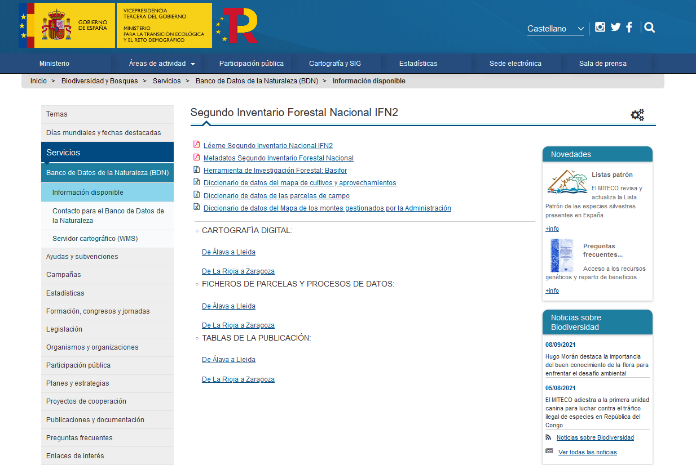

#### 2.1.2. IFN3

La información del tercer ciclo del Inventario Forestal Nacional (IFN3) fue realizado entre los años 1997-2007 y se encuentra disponible en ficheros MDB de Access comprimidos en formato ZIP o bien en formato .accdb a través de la web del Ministerio para la Transición Ecológica y el Reto Demográfico en [este enlace.](https://www.miteco.gob.es/es/biodiversidad/servicios/banco-datos-naturaleza/informacion-disponible/ifn3_base_datos_26_50.aspx)

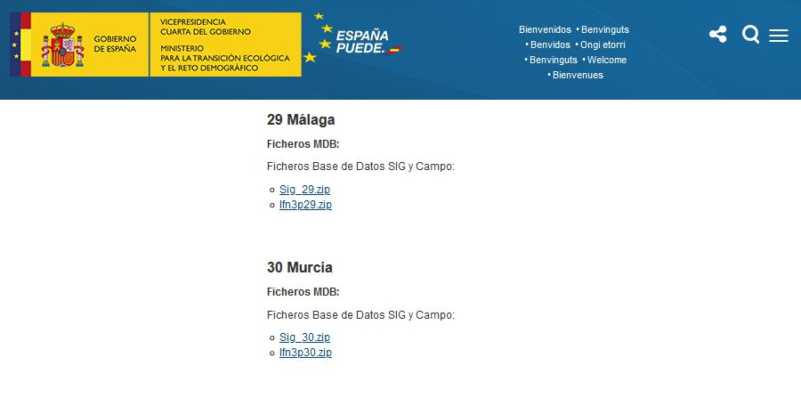

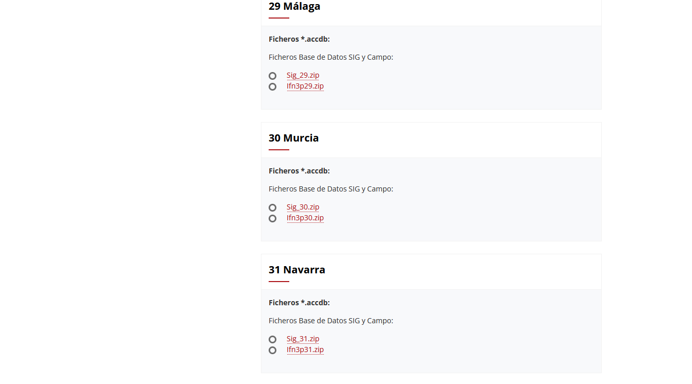

### 2.2. Preparación y limpieza de los datos

### 2.2.1. IFN3

Una vez descargadas y descomprimidas los ficheros de bases de datos SIG y Campo de la provincia de Málaga es posible abrirlos empleando la librería odbc, cuyo objetivo es proporcionar una interfaz para los controladores de Open Database Connectivity (ODBC) y también la librería DBI que permite una definición de interfaz de la base de datos para la comunicación entre R y los sistemas de gestión de bases de datos relacionales.

```r
#Librería ODBC que permite la conectividad ODBC con Bases de Datos
# install.packages("odbc")
library(odbc)
# Librería DBI que permite comunicación con BD relacional
# install.packages("DBI")
library(DBI)
```

```r
#Listar drivers
odbc::odbcListDrivers()
```

```r annotate
## name 	attribute 	value
## SQL Server 	APILevel 	2
## SQL Server 	ConnectFunctions 	YYY
## SQL Server 	CPTimeout 	60
## SQL Server 	DriverODBCVer 	03.50
## SQL Server 	FileUsage 	0
## SQL Server 	SQLLevel 	1
## SQL Server 	UsageCount 	1
## Microsoft Access Driver (.mdb, .accdb) 	UsageCount 	3
## Microsoft Access Driver (.mdb, .accdb) 	APILevel 	1
## Microsoft Access Driver (.mdb, .accdb) 	ConnectFunctions 	YYN
## Microsoft Access Driver (.mdb, .accdb) 	DriverODBCVer 	02.50
## Microsoft Access Driver (.mdb, .accdb) 	FileUsage 	2
## Microsoft Access Driver (.mdb, .accdb) 	FileExtns 	.mdb,.accdb
## Microsoft Access Driver (.mdb, .accdb) 	SQLLevel 	0
## Microsoft Excel Driver (.xls, .xlsx, .xlsm, .xlsb) 	UsageCount 	3
## Microsoft Excel Driver (.xls, .xlsx, .xlsm, .xlsb) 	APILevel 	1
## Microsoft Excel Driver (.xls, .xlsx, .xlsm, .xlsb) 	ConnectFunctions 	YYN
## Microsoft Excel Driver (.xls, .xlsx, .xlsm, .xlsb) 	DriverODBCVer 	02.50
## Microsoft Excel Driver (.xls, .xlsx, .xlsm, .xlsb) 	FileUsage 	2
## Microsoft Excel Driver (.xls, .xlsx, .xlsm, .xlsb) 	FileExtns 	.xls,.xlsx, *.xlsb
## Microsoft Excel Driver (.xls, .xlsx, .xlsm, .xlsb) 	SQLLevel 	0
## Microsoft Access Text Driver (.txt, .csv) 	UsageCount 	3
## Microsoft Access Text Driver (.txt, .csv) 	APILevel 	1
## Microsoft Access Text Driver (.txt, .csv) 	ConnectFunctions 	YYN
## Microsoft Access Text Driver (.txt, .csv) 	DriverODBCVer 	02.50
## Microsoft Access Text Driver (.txt, .csv) 	FileUsage 	2
## Microsoft Access Text Driver (.txt, .csv) 	FileExtns 	.txt, .csv
## Microsoft Access Text Driver (.txt, .csv) 	SQLLevel 	0 
```

Si no aparece "Microsoft Access dBASE Driver" se deberá instalar el [driver de DB Access](https://www.microsoft.com/en-us/download/confirmation.aspx?id=54920)

Para comenzar, se introduce la ruta a la base de datos de campo y se establece la conexión:
```r
#Ruta a la Base de datos de Access
IFN3 = "C:/DESCARGA//IFN3/Malaga/Ifn3p29.accdb" #Adaptar a la ruta que se vaya a emplear en el equipo

#Conexión a BD Access. Indicamos encoding
con <- dbConnect(odbc::odbc(), 
                 .connection_string = paste0("Driver={Microsoft Access Driver (*.mdb, *.accdb)};DBQ=",IFN3,";"),
                 encoding = "latin1")
```

Se ha abierto, por tanto, un canal hacía la base de datos al que se le ha llamado *con*. Se trabaja con ella como un objeto que contiene toda la información para hacer una conexión usando ODBC, incluyendo el tipo de conexión, la dirección de la máquina donde está la base de datos, y el nombre de la base de datos.  

Finalmente, se imprime en pantalla el listado de tablas presentes en la base de datos.
```r
#Listado de tablas de la base de datos
dbListTables(con) 
```

```r annotate
##  [1] "MSysAccessStorage"          "MSysAccessXML"             
##  [3] "MSysACEs"                   "MSysComplexColumns"        
##  [5] "MSysIMEXColumns"            "MSysIMEXSpecs"             
##  [7] "MSysNavPaneGroupCategories" "MSysNavPaneGroups"         
##  [9] "MSysNavPaneGroupToObjects"  "MSysNavPaneObjectIDs"      
## [11] "MSysObjects"                "MSysQueries"               
## [13] "MSysRelationships"          "Errores de conversión"     
## [15] "PCDatosMap"                 "PCEspMapa"                 
## [17] "PCEspParc"                  "PCMatorral"                
## [19] "PCMayores"                  "PCMayores2"                
## [21] "PCNueEsp"                   "PCParcelas"                
## [23] "PCRegenera"                 "PCTablaEsp"
```

Todas las bases de datos de Microsoft Access contienen varias tablas de "sistema" (todas las tablas cuyo nombre comienza por *Msys*) que se utilizan para codificar metadatos sobre la base de datos, como relaciones de clave primaria/clave externa (*MsysRelationships*) y tiempos de creación y actualización de consultas (*MsysObjects*). De forma predeterminada, el usuario no puede acceder a estas tablas, pero un usuario avanzado puede ejecutar consultas de alto nivel en ellas.  

Este apartado se centrará, por el contrario, en utilizar las tablas referentes a la información forestal. En la página web del Ministerio para la Transición Ecológica y el Reto Demográfico se puede encontrar [documentación relativa para la descripción de las tablas y códigos utilizados en esta base de datos.](https://www.miteco.gob.es/es/biodiversidad/servicios/banco-datos-naturaleza/documentador_bdcampo_ifn3_tcm30-282240.pdf)  

Se comienza leyendo los campos de la tabla de parcelas (*PCParcelas*)

```r
#Leer tabla
PCParcelas <- dbReadTable(con, "PCParcelas")

#Ver datos de las 2 primeras filas
head(PCParcelas,2)

#Convertir la matriz en un data frame para poder trabajar mejor con ella en R
PCParcelas<-as.data.frame(PCParcelas)
names(PCParcelas)
```

```r annotate
##  [1] "Provincia" "Estadillo" "Cla"       "Subclase"  "CoorX"     "Coory"    
##  [7] "Tipo"      "Vuelo1"    "Pasada1"   "Foto1"     "Vuelo2"    "Pasada2"  
## [13] "Foto2"     "Ano"       "INE"       "Nivel1"    "Nivel2"    "Nivel3"   
## [19] "FccTot"    "FccArb"    "DisEsp"    "ComEsp"    "Rocosid"   "Textura"  
## [25] "MatOrg"    "PhSuelo"   "FechaPh"   "HoraPh"    "TipSuelo1" "TipSuelo2"
## [31] "TipSuelo3" "MErosiva"  "ModComb"   "EspCMue"   "PresReg"   "EfecReg"  
## [37] "CortaReg"  "MejVue1"   "MejVue2"   "MejSue1"   "MejSue2"   "Orienta1" 
## [43] "Orienta2"  "MaxPend1"  "MaxPend2"  "Localiza"  "Acceso"    "Levanta"  
## [49] "Obser"     "Equipo"    "JefeEq"    "FechaIni"  "HoraIni"   "FechaFin" 
## [55] "HoraFin"   "Tiempo"    "Resid"     "RumboF1"   "RumboF2"   "DistFoto" 
## [61] "CarFoto1"  "NumFoto1"  "ConFoto1"  "CarFoto2"  "NumFoto2"  "ConFoto2" 
## [67] "Estado"    "Tecnico"
```

Se va a intentar la representación cartográfica de las parcelas empleadas en el inventario. Los campos "CoorX" y "Coory" representan las coordenadas X e Y en el sistema de referencia local que se empleaba cuando se generaron los datos, el sistema European Datum 1950 UTM zona 30 Norte. Sin embargo, como se verá ahora, estos campos presentan errores que debemos subsanar para poder realizar el ploteado.

```r
summary(PCParcelas$CoorX)
```

```r annotate
##    Min. 1st Qu.  Median    Mean 3rd Qu.    Max. 
##       0  301996  323011  321470  350361 2985988
```

```r
summary(PCParcelas$Coory)
```

```r annotate
##    Min. 1st Qu.  Median    Mean 3rd Qu.    Max. 
##       0 4048976 4059702 3906133 4077000 4127000
```

```r
PCParcelas<-PCParcelas[which(PCParcelas$CoorX>0),]
PCParcelas<-PCParcelas[which(PCParcelas$CoorX<500000),]
PCParcelas<-PCParcelas[which(PCParcelas$Coory>4000000),]

```

Hay numerosos registros en los que el valor de la coordenada X o Y es 0. También se dan errores humanos de introducción de los datos, como uno de los registros de las coordenadas X por encima del parámetro de falso este de 500.000 de los valores de definición de la proyección o el registro con valor de 4092.2 en las coordenadas de las Y, en lugar de valores por encima de 4.000.000, que es donde se sitúan las latitudes en las que se encuentra el área de estudio. Al eliminarlos se puede visualizar la localización de las parcelas. Para ello, se empleará la librería sf, que proporciona una forma estandarizada de codificar datos vectoriales.  

```{r warning=FALSE}
#Activar la librería sf necesaria para datos espaciales
# install.packages("sf")
library(sf)
#Convertir data frame a SpatialPointsDataFrame
IFN3.sp <- st_as_sf(x=PCParcelas,coords=c("CoorX","Coory"), crs=23030)
plot(st_geometry(IFN3.sp), axes=TRUE,main="Parcelas IFN3 en la provincia de Málaga")

```

El siguiente paso corresponde a la selección de las parcelas encontradas en el interior del monte Pinar de Yunquera. Para ello, ambas capas deben compartir el mismo sistema de referencia.  
Una vez realizada la transformación del sistema de coordenadas, ya es posible la representación conjunta de los datos.

```{r echo=FALSE, include=FALSE}
library(sf)
#Lectura de la capa kml
Montes.Publicos<-st_read("E:/MAVARO/clases/Centro_Competencias_Digitales/Montes_Publicos_Malaga.kml")
#Seleccion de la zona de estudio
MA.30037.AY<-Montes.Publicos[which(Montes.Publicos$Name=="MA-30037-AY"),1]
#Selección de Pinar de Yunquera
Pinar.Yunquera<-MA.30037.AY[1,]

#Proyección de la capa del monte al mismo crs que los puntos
Pinar.Yunquera<-st_transform(Pinar.Yunquera,
                             crs=32630)
```

```{r warning=FALSE}
#Convertir los datos a coordenadas geograficas en wgs84
IFN3.sp.WGS84.geograf<-st_transform(IFN3.sp,4326)

#Convertir los datos a coordenadas cartograficas en wgs84
IFN3.sp.WGS84.UTM30N<-st_transform(IFN3.sp.WGS84.geograf,crs=st_crs(32630))

plot(st_geometry(IFN3.sp.WGS84.UTM30N),axes=TRUE,main="Parcelas IFN3 en la provincia de Málaga")
plot(st_geometry(Pinar.Yunquera), border="red", add=TRUE)

```

Del total de las parcelas, se seleccionarán las que se localizan en el interior de la zona de estudio. Para ello, se realizará una intersección geográfica entre ambas capas.

```{r }
#Selección de parcelas
IFN3.monte<-IFN3.sp.WGS84.UTM30N[which(st_within(IFN3.sp.WGS84.UTM30N,
                                            st_geometry(Pinar.Yunquera),
                                            sparse=FALSE)==TRUE),]

length(unique(IFN3.monte$Estadillo))

```

27 son las parcelas del IFN en el monte Pinar de Yunquera.

Abrimos ahora la tabla de Pies Mayores.

```{r }
#Leer tabla de pies mayores
PCMayores <- dbReadTable(con, "PCMayores")

#Nombre de los campos de la tabla
names(PCMayores)
```

Al tratarse de una base de datos relacional, para cada *Estadillo* o parcela de la tabla *PCParcelas* existen varios elementos u observaciones que corresponden en la tabla *PCMayores*. Ahora deben seleccionarse los pies de las parcelas que están incluidos en el interior del monte.

```{r }
#Unión de tablas por el concepto común Estadillo
Pies.IFN3.monte<-merge(IFN3.monte,PCMayores,by="Estadillo",all.x=TRUE)
```

### 4.2.2. IFN2

Durante el procesado de los datos en el IFN2, se generaron 5 tablas con los datos recogidos en campo y 3 más con los datos procesados y agrupados.


Por otro lado, las tablas descargadas referentes al Inventario Forestal Nacional 2 se sirven en formato *.dbf*. Históricamente, este tipo de archivos supusieron una solución de base de datos muy popular para MS-DOS que más tarde fue llevado a otras plataformas como Unix y dio inicio a una serie de productos similares. Básicamente, este formato permite organizar los datos en varios registros con campos con un encabezado con información sobre la estructura de datos y de los registros mismos. Además, es compatible con Windows, Linus y Mac.

Para el desarrollo del ejercicio, se van a emplear la tabla de pies mayores y la de valores resumidos por estadillo.

```{r }
#Librería que permite la lectura de archivos .dbf
library(foreign)

#Leer tabla de pies mayores
Pies.Mayores.IFN2<-read.dbf("E:/MAVARO/clases/Centro_Competencias_Digitales/DESCARGAS_IFN/IFN2/Malaga/PIESMA29.dbf")

#Leer tabla de valores agrupados por estadillo
resumen.parcela.IFN2<-read.dbf("E:/MAVARO/clases/Centro_Competencias_Digitales/DESCARGAS_IFN/IFN2/Malaga/IIFL03BD.dbf")
```

Para poder trabajar con datos temporales pertenecientes a ambos inventarios, es necesario homogeneizar los nombres y tipos de los campo.
Así, por ejemplo, los nombres de los campos de las tablas del IFN2 están en mayúscula, mientras que las del IFN3 están en minúscula. Es necesario unificar criterios para poder ejecutar uniones de tablas. Sin embargo, es necesario tener en cuenta que los campos que se hacen referencia a la geometría espacial de los puntos, deben permanecer en su estado actual para que puedan ser identificados como tales.

```{r }
#Nombres de los campos de la tabla del IFN2
names(Pies.Mayores.IFN2)

#Nombres de los campos de la tabla del IFN3
names(Pies.IFN3.monte)

#Conversión a mayúsculas
names(Pies.IFN3.monte)<-toupper(names(Pies.IFN3.monte))

#Recuperación del nombre del campo de geometría
names(Pies.IFN3.monte)[86]<-"geometry"
```

Uno de los campos comunes que sirve para identificar cada pie en cada una de las mediciones temporales es el número de orden que se empleó en la evaluación del árbol en cada inventario. Por eso, es necesario usar una denominación común en ambas tablas.

```{r }
#Cambiar nombre del campo que marca el orden del número de pie en el IFN2
names(Pies.Mayores.IFN2)[3]<-"ORDENIF2"
```

Además, los campos comunes entre ambas tablas deben pertenecer a la misma clase para poder relacionarlas, es decir, si en una tabla contiene valores numéricos en la otra también deben ser numéricos.

```{r }
#Comprobación de la clase del objeto en la tabla IFN2
is.numeric(Pies.Mayores.IFN2$ESTADILLO)

#Comprobación de la clase del objeto en la tabla IFN3
is.numeric(Pies.IFN3.monte$ESTADILLO)

#Conversión en valor numérico
Pies.IFN3.monte$ESTADILLO<-as.numeric(as.character(Pies.IFN3.monte$ESTADILLO))

#Comprobación de la clase del objeto en la tabla IFN2
is.numeric(Pies.IFN3.monte$ORDENIF2)

#Comprobación de la clase del objeto en la tabla IFN3
is.numeric(Pies.Mayores.IFN2$ORDENIF2)

#Conversión en valor numérico
Pies.IFN3.monte$ORDENIF2<-as.numeric(as.character(Pies.IFN3.monte$ORDENIF2))
```

Los campos que van a servir para ejecutar operaciones, por ejemplo, la media entre los 2 diámetros normales o la altura de los pies, es necesario que sean de la clase numérica.

```{r }
#Comprobación de la clase del objeto DIAMETRO1
is.numeric(Pies.Mayores.IFN2$DIAMETRO1)

#Comprobación de la clase del objeto DIAMETRO2
is.numeric(Pies.Mayores.IFN2$DIAMETRO2)

#Conversión en valor numérico
Pies.Mayores.IFN2$DN1.IFN2<-as.numeric(as.character(Pies.Mayores.IFN2$DIAMETRO1))

#Conversión en valor numérico
Pies.Mayores.IFN2$DN2.IFN2<-as.numeric(as.character(Pies.Mayores.IFN2$DIAMETRO2))

#Comprobación de la clase del objeto ALTURA
is.numeric(Pies.Mayores.IFN2$ALTURA)

#Conversión en valor numérico
Pies.Mayores.IFN2$HT.IFN2<-as.numeric(as.character(Pies.Mayores.IFN2$ALTURA))
```

Por otro lado, de nada sirve para los cálculos que falten los datos de cualquiera de los 2 años. Algunos de los árboles inventariados, al ser visitados de nuevo, habían muerto o habían sido tumbados, por lo que no se incorporaron en el IFN3. Puesto que se trata de trabajar con valores multitemporales, se van a seleccionar los pies en los que se ejecutaron mediciones repetidas en uno y otro inventario.

```{r }
#Selección de pies comunes entre ambos inventarios
Pies.IFN3.monte.com<-Pies.IFN3.monte[which(Pies.IFN3.monte$ORDENIF2!=0),]
```

Finalmente, se unen ambas tablas.

```{r }
#Unión de tablas del IFN2 y IFN3
Pies.monte.IFN<-merge(Pies.IFN3.monte.com,Pies.Mayores.IFN2,
                      by=c("ESTADILLO","ORDENIF2"))
```

Por otro lado, para considerar la densidad en la caracterización de los crecimientos, se hace uso de la tabla de valores agrupados por estadillo.

```{r }
resumen.parcela<-aggregate(resumen.parcela.IFN2$NARBOLES,
                           by=list(resumen.parcela.IFN2$CESTADILLO),FUN=sum,
                           na.rm=TRUE)

#Primeros 6 valores de la tabla
head(resumen.parcela)

#Nombre de los campos de la tabla
names(resumen.parcela)

#Cambio de nombre de los campos de la tabla
names(resumen.parcela)<-c("ESTADILLO","Npies_parc")

#Comprobación de la clase del objeto ESTADILLO
is.numeric(resumen.parcela$ESTADILLO)
```

### 3.3. Análisis de los datos

En el Inventario Forestal Nacional, el diámetro normal se mide cuidadosamente a 1,30 m del suelo, con una forcípula graduada para apreciar el milímetro, en dos direcciones perpendiculares, de tal manera que, en la primera de ellas, el eje del aparato esté alineado con el centro de la parcela. Para el análisis de datos, necesitamos el valor medio de ambas mediciones.

```{r }
#Cálculo de valor medio del diámetro normal en IFN2
Pies.monte.IFN$DN.IF2<-(Pies.monte.IFN$DN1.IFN2+Pies.monte.IFN$DN2.IFN2)/2

#Cálculo de valor medio del diámetro normal en IFN3
Pies.monte.IFN$DN.IFN3<-(Pies.monte.IFN$DN1+Pies.monte.IFN$DN2)/2
```


```{r }
#Diferencias de diámetros entre los 2 tiempos
Pies.monte.IFN$Dif.DN<-Pies.monte.IFN$DN.IFN3-Pies.monte.IFN$DN.IF2

#Diferencias de alturas entre los 2 tiempos
Pies.monte.IFN$Dif.H<-Pies.monte.IFN$HT-Pies.monte.IFN$HT.IFN2
```

```{r }
#Eliminación de errores de medición
Pies.monte.IFN<-Pies.monte.IFN[which(Pies.monte.IFN$Dif.DN>0&
                                       Pies.monte.IFN$Dif.H>0),]
```

Como en todos los ejercicios, se va a evaluar más concretamente la especie de pinsapo, que corresponde a la de código 32.

```{r }
#Pies de pinsapo
pinsapo<-Pies.monte.IFN[which(Pies.monte.IFN$ESPECIE.x=="032"),]

#Parcelas de pinsapo
parcelas.pinsapo<-unique(pinsapo[,c('ESTADILLO', 'geometry')])

```

Será interesante conocer cómo se comportan los crecimientos en altura y en diámetro normal según las densidades de la parcela y ver qué patrón espacial representa el resultado. Por eso, se agregan los valores medios por parcela y se le añaden los valores del resumen del total de densidad de pies de cada parcela y la geometría de las parcelas.

```{r }
#Valores medios de crecimientos por ESTADILLO
resumen.pinsapo<-aggregate(cbind(Dif.DN,Dif.H)~ESTADILLO,
                     data=pinsapo,FUN=mean,na.rm=TRUE)

#Añadir valores de densidad de las parcelas
resumen.pinsapo<-merge(resumen.pinsapo,resumen.parcela,by="ESTADILLO")

#Añadir geometría
resumen.pinsapo<-merge(resumen.pinsapo,parcelas.pinsapo,by="ESTADILLO")

#Conversión de la tabla en datos geográficos
resumen.pinsapo<-st_as_sf(resumen.pinsapo)
```

Se puede explorar la asociación de interdependencia que cabría pensar que pudiera existir entre los crecimientos en altura y en diámetro, con la densidad de la parcela. 

Para saber cuál método usar para calcular el coeficiente de correlación entre las variables, primero es necesario explorar si tienen una distribución normal.

```{r }
#Histograma de los datos de altura
hist(resumen.pinsapo$Dif.H)

#Histograma de los datos de dap
hist(resumen.pinsapo$Dif.DN)

#Histograma de los datos de dap
hist(resumen.pinsapo$Npies_parc)
```

Ninguna de las variables sigue una distribución normal, por lo que el método empleado será el de Spearman.

```{r }
#Test de correlación entre las alturas y las densidades
correlacion.alturas<-cor.test(resumen.pinsapo$Dif.H,
                              resumen.pinsapo$Npies_parc,
                              method="spearman")

#Correlación entre las alturas y las densidades
correlacion.alturas$estimate

#Significancia de la correlación entre las alturas y las densidades
correlacion.alturas$p.value

#Test de correlación entre los diámetros y las densidades
correlacion.diametros<-cor.test(resumen.pinsapo$Dif.DN,
                                resumen.pinsapo$Npies_parc,
                                method="spearman")

#Correlación entre los diámetros y las densidades
correlacion.diametros$estimate

#Significancia de la correlación entre las alturas y las densidades
correlacion.diametros$p.value
```

Ninguna de las correlaciones con la densidad parece tener significancia estadística. Sin embargo, este bajo valor es probable que se deba a la muestra tan pequeña de parcelas en la que se ha empleado. Sería necesario aumentar la superficie de estudio y, por tanto, el número de parcelas, para contrastar los resultados, ya que la asociación de interdependencia esperada responde a una hipótesis plausible y lógica contrastada en el mundo forestal.

### 3.4. Visualización de los datos

Se puede entender la dinámica general del crecimiento en las especies forestales del monte, a través de un gráfico donde se representen los segmentos de crecimiento de cada uno de los pies.

```{r }
plot(0,0,col = "white",
     xlim=c(80,900),ylim=c(0,21),main="Crecimientos.Todas las especies",
     xlab="dap (mm)", ylab="altura (m)")
segments(Pies.monte.IFN$DN.IFN3,Pies.monte.IFN$HT,
         Pies.monte.IFN$DN.IF2,Pies.monte.IFN$HT.IFN2,
         col=rgb(0,0,0,0.35))
```

Si se particulariza a nivel especie, se pueden intuir dinámicas distintas.

```{r }
plot(0,0,col = "white",
     xlim=c(80,900),ylim=c(0,21),main="Crecimientos.Todas las especies",
     xlab="dap (mm)", ylab="altura (m)")
segments(Pies.monte.IFN$DN.IFN3[which(Pies.monte.IFN$ESPECIE.x=="021")],
         Pies.monte.IFN$HT[which(Pies.monte.IFN$ESPECIE.x=="021")],
         Pies.monte.IFN$DN.IF2[which(Pies.monte.IFN$ESPECIE.x=="021")],
         Pies.monte.IFN$HT.IFN2[which(Pies.monte.IFN$ESPECIE.x=="021")],
         col="red")
segments(Pies.monte.IFN$DN.IFN3[which(Pies.monte.IFN$ESPECIE.x=="024")],
         Pies.monte.IFN$HT[which(Pies.monte.IFN$ESPECIE.x=="024")],
         Pies.monte.IFN$DN.IF2[which(Pies.monte.IFN$ESPECIE.x=="024")],
         Pies.monte.IFN$HT.IFN2[which(Pies.monte.IFN$ESPECIE.x=="024")],
         col="green")
segments(Pies.monte.IFN$DN.IFN3[which(Pies.monte.IFN$ESPECIE.x=="026")],
         Pies.monte.IFN$HT[which(Pies.monte.IFN$ESPECIE.x=="026")],
         Pies.monte.IFN$DN.IF2[which(Pies.monte.IFN$ESPECIE.x=="026")],
         Pies.monte.IFN$HT.IFN2[which(Pies.monte.IFN$ESPECIE.x=="026")],
         col="black")
segments(Pies.monte.IFN$DN.IFN3[which(Pies.monte.IFN$ESPECIE.x=="032")],
         Pies.monte.IFN$HT[which(Pies.monte.IFN$ESPECIE.x=="032")],
         Pies.monte.IFN$DN.IF2[which(Pies.monte.IFN$ESPECIE.x=="032")],
         Pies.monte.IFN$HT.IFN2[which(Pies.monte.IFN$ESPECIE.x=="032")],
         col="blue")
legend("bottomright",legend=c("Pinus sylvestris","Pinus pinea",
                              "Pinus pinaster","Abies pinsapo"),
       col=c("red","green","black","blue"),lty=c(1,1,1,1),cex=0.75,
       box.lty=0)
```

La especie que parece mostrar mayor variabilidad de comportamiento en su crecimiento es el pinsapo. Por eso, se va a particularizar para dicha especie.

```{r }
plot(0,0,col = "white",
     xlim=c(80,900),ylim=c(0,21),main="Crecimientos.Pinsapo",
     xlab="dap (mm)", ylab="altura (m)")
segments(pinsapo$DN.IFN3,pinsapo$HT,
         pinsapo$DN.IF2,pinsapo$HT.IFN2,
         col=rgb(0,0,0,0.35))
```


### 3.5. Los datos contando historias...

Espacialmente, se puede visualizar dónde han ocurrido los mayores cambios tanto en diámetros,... 

```{r warning=FALSE}
opar<-par()

#Gráfico de la geometría del monte
plot(st_geometry(Pinar.Yunquera),axes=TRUE)

#Localización de las parcelas de pinsapo según su crecimiento en dap
plot(resumen.pinsapo["Dif.DN"], breaks=c(0,30,60,90),
     pal = sf.colors(3),
     pch=19,add=TRUE)

#Leyenda
legend("bottomright",
       legend=c("0-30","30-60","60-100"),
       col=rev(sf.colors(3)),
       lty=1,cex=0.85, box.lty=0)
par(opar)
```

..., como en alturas.

```{r warning=FALSE}
#Gráfico de la geometría del monte
plot(st_geometry(Pinar.Yunquera),axes=TRUE)

#Localización de las parcelas de pinsapo según su crecimiento en altura
plot(resumen.pinsapo["Dif.H"], breaks=c(0,1,1.5,2,2.5,3),
     pal = sf.colors(5),
     pch=19,add=TRUE)

#Leyenda
legend("bottomright",
       legend=c("0-1","1-1.5","1.5-2","2-2.5","2.5-3"),
       col=rev(sf.colors(5)),
       lty=1,cex=0.85, box.lty=0)
par(opar)
```

Parece que, en altura las mayores diferencias suceden en la zona sur y sur-oeste, mientras que es justo ahí, donde menos crecimiento diametral se produce. Es probable que, al estar bajo una mayor presión de densidad y competencia en dicha zona los coeficientes de esbeltez del arbolado hayan aumentado, produciendo una masa frágil y poco estable a eventos de vientos extremos.

```{r warning=FALSE}
#Gráfico de la geometría del monte
plot(st_geometry(Pinar.Yunquera),axes=TRUE)

#Localización de las parcelas de pinsapo según su crecimiento en altura
plot(resumen.pinsapo["Npies_parc"], breaks=c(0,200,400,600,800),
     pal = sf.colors(4),
     pch=19,add=TRUE)

#Leyenda
legend("bottomright",
       legend=c("0-200","200-400","400-600","600-800"),
       col=rev(sf.colors(4)),
       lty=1,cex=0.85, box.lty=0)
```
